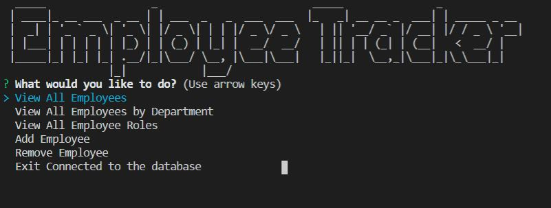

# Employee Tracker

### Overview

The employee tracker is command line application that allows a user to look up, add, and edit employee information. The tools used to create this project are node, inquirer, and mySQL. The database currently has dummy data but can be changed based on the individuals company.

The user can scroll through the options to bring up the specific data they would like to see. They can also add and remove employee records from the database. The overall application is pretty basic at the moment with hopeful improvements to come at a future date.

